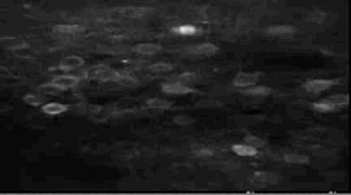
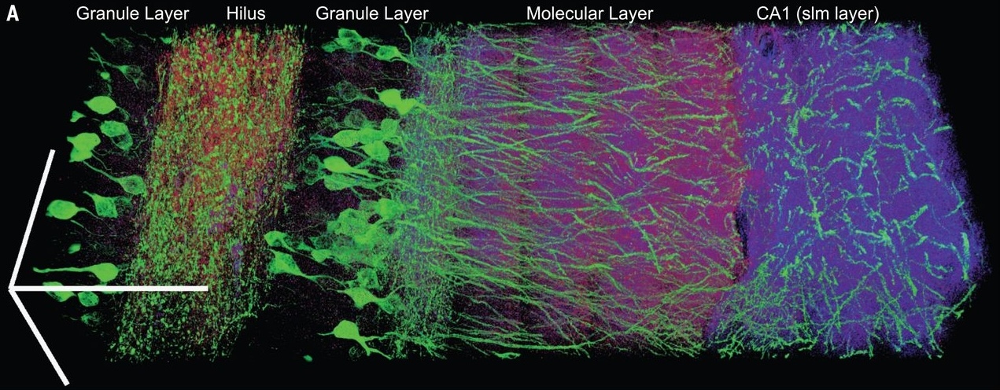

# Entailment Trees: A Framework for Evaluating Scientific Ideas

As AI systems become more intelligent, it ought to be possible to use them to both discover truly interesting new scientific ideas and evaluate them. Additionally, we need systems that can make their reasoning and evaluation clear to us. It's not helpful if an AI system gives you 20 pages of impenetrable reasoning when you're the one who has to sign the check or run the experiment. You need to understand what's going on, how the different parts of the idea play together, what the critical bottlenecks or risky parts are, etc.

To address this, we explore the framework of **entailment trees**.

Entailment trees formalize a simple idea: to understand a big idea, break it down into simpler parts. In these trees, we break claims into premises that, if true, imply the claim. This kind of relationship is called "entailment." 

More formally, in an entailment tree, there are **claim nodes** that represent claims that can be evaluated as true or false with varying degrees of certainty, and logical **AND** and **OR** nodes. Multiple claim nodes can point to a single logical node:

- If multiple claims lead into an **AND** node, they are ANDed together; i.e., the resulting claim is true if and only if every subclaim is true.
- If multiple claims lead into an **OR** node, they are ORed together; i.e., the resulting claim is true if at least one subclaim is true.

A single logical node can then lead to a claim node, defining the entailment relationship.

---

## The Demanding "AND"

ANDing multiple claims together captures the intuition that many things have to work together for an idea to work out. Breaking down the idea into its components is designed to identify claims that are more specific and more usefully concrete. This was one of the original motivations; if you could repeatedly break down an idea into more fundamental parts, these would be easier to evaluate and understand.

---

## The Transformative "OR"

When it comes to transformative ideas, breakthroughs often strike when someone comes up with a new perspective on an old problem.

<figure style="text-align: center; margin: 2em 0;">
  
  <figcaption style="margin-top: 0.5em; font-style: italic; color: #666;">
    GCaMP6s fluorescence reveals neural activity in real time—no electrodes required.
  </figcaption>
</figure>

<figure style="text-align: center; margin: 2em 0;">
  
  <figcaption style="margin-top: 0.5em; font-style: italic; color: #666;">
    Expansion microscopy physically enlarges samples, achieving nanoscale resolution with conventional optics.
  </figcaption>
</figure>

<figure style="text-align: center; margin: 2em 0;">
  
  <figcaption style="margin-top: 0.5em; font-style: italic; color: #666;">
    Scaling laws: more data and compute yield predictable improvements in AI performance.
  </figcaption>
</figure>

Each of these approaches reimagine new solutions for old problems—that moment of "we could do this OR we could do that" that opened up an entirely new way of interacting with the problem. The ability to introduce OR nodes in the graph represents this possibility.

---

## The "Epistemic" Cost Function

Something that we've been after is a "cost function" for ideas. The cost function should:

1. Have **0 cost** if the idea will work (i.e., you can record neural activity with an electrode)
2. Have a **very high cost** if the idea working requires violating facts that are known in the world (e.g., you can travel backwards through time)
3. **Scale with the uncertainty** of the idea

The nice thing about entailment trees is that you can use them to define a cost function that satisfies all these criteria.

To do so, you assign each leaf a "probability" *P* from 0 (False) to 1 (True), with 0.5 being maximally unsure. Then, you define the cost of each leaf node to be −log₂(*P*). Finally, you propagate scores from the premise nodes to non-leaf conclusion nodes using the logical nodes as follows:

- **AND**: Cost(C) = Σ −log *Pᵢ*
- **OR**: Cost(C) = min −log *Pᵢ*

The cost function has the properties we outlined. True claims don't add anything to the cost (−log 1 = 0), while expressly false claims add a lot (infinite if the claim probability is 0).

